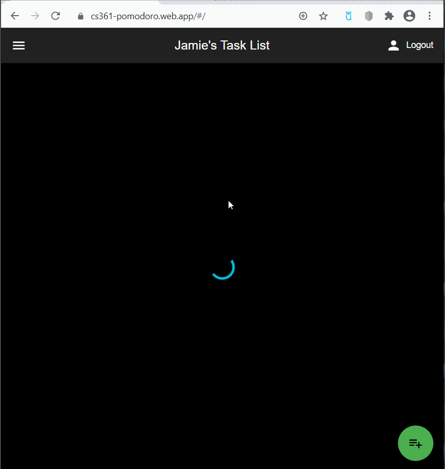

# 🍅 *CS361-Pomodoro*

**CS361-Pomodoro** is a Pomodoro timer web app created with Dart/Flutter that utilizes Firebase to allow users to create accounts and customize tasks.  This app was created using the Agile/Scrum process.

Hosting URL: [https://cs361-pomodoro.web.app](https://cs361-pomodoro.web.app)

## 🤓 Authors
- [Jamie Mott](https://github.com/jamiemott)
- [Maliha Syed](https://github.com/maldz3)
- [Noah Johnston](https://github.com/NDJ-1701)
- [Leonard LoBiondo](https://github.com/Len-LoBo)
- [Justin Lin](https://github.com/jlin88)

## Video Walkthrough

Here's a walkthrough:

GIF created with [LiceCap](http://www.cockos.com/licecap/).
